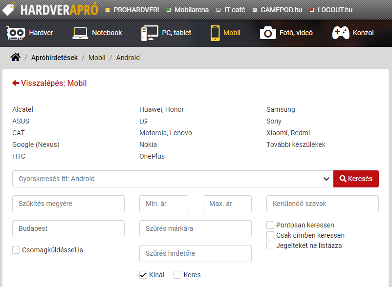
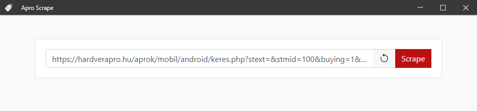

# AproScrape 

Get instantly notified about new items you are interested in!

Have you ever browsed [HardverApro](http://hardverapro.hu/index.html),
found a good deal and wrote to the seller just to find out someone has already bought the item?  
If you feel like you have to be on the site 24/7 to get something with a very good price,
this app is for you!

## What is AproScrape

AproScrape is a free, opensource web scraper which will periodically check HardverApro
for new items you are searching for and display a notification when it finds one,
so you can contact the seller as fast as you can.

## Installation

Dowload the latest version from the [releases](https://github.com/Lehoczky/apro-scrape/releases) page.
Installers are available for all platforms (Windows, Linux, OSX).

## Usage

Go to hardverapro.hu, navigate to a topic you are interested in, like the Android phone's page.

In this example I will also use the detailed search option to only see items from Budapest.

Now hit search, and copy the URL from your browser, then open AproScrape
and paste the link to the input field on the top.

Press the `SCRAPE` button, and you should see deals from the website.

Here comes the fun part: If you minimize the window, it will hide to the taskbar,
and display a notification when it finds new items!

Open the app by clicking on the notification or the icon in the taksbar, and click
on the item's link. It will navigate you straight to HardverApro and you can contact
the seller immediately!

_Note: highlighted item are excluded, since they are always at the top of the page and it doesn't make sense to scrape them._

## A word on scraping interval

Scraping interval defines how often the program should check HardverApro for new items.

You can leave it as is (60 seconds). By raising the value, you will get fewer notifications
but possibly with more items. In contrast lowering it may result in more notifications which
can be annoying, but you have the chance to find new item sooner.

## Feedback

Feedbacks are always welcome! If you have an idea how to make AproScrape better or found a bug,
[open a new issue](https://github.com/Lehoczky/apro-scrape/issues) and I'll read it for sure.
Pull requests are also appreciated!

## Built with

Special thanks to the creators of these libraries:

